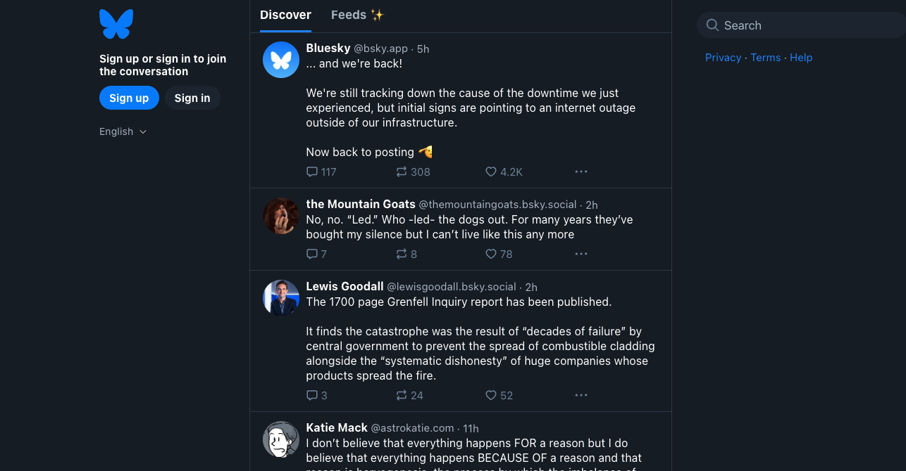

# PDS (Personal Data Server) CI/CD pipeline

Deploy PDS (Personal Data Server)  server with CI/CD on Elestio

 
 

# Once deployed ...

You can open PDS Server URL here:

- Visit https://bsky.app
- Click on Sign In, replace the Bluesky `Hosting provider` with your own pds server url `[CI_CD_DOMAIN]` 

        URL: https://[CI_CD_DOMAIN]
        username: superadmin / [ADMIN_EMAIL]
        password: [ADMIN_PASSWORD]

Connecting to your PDS with the Bluesky app is possible. 

1. You can use any Bluesky app:
    - [Bluesky for Web](https://bsky.app/)
    - [Bluesky for iPhone](https://apps.apple.com/us/app/bluesky-social/id6444370199)
    - [Bluesky for Android](https://play.google.com/store/apps/details?id=xyz.blueskyweb.app)
2. Enter the URL of your PDS (e.g. `https://[CI_CD_DOMAIN]/`)
